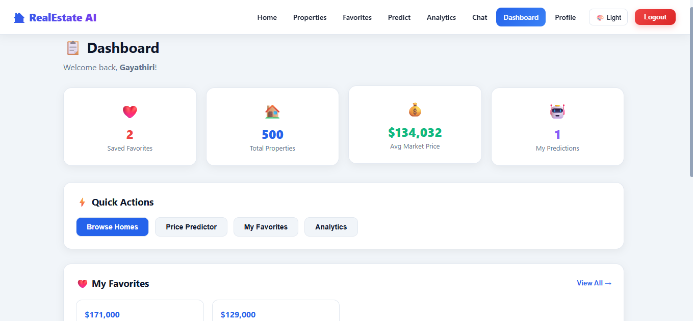
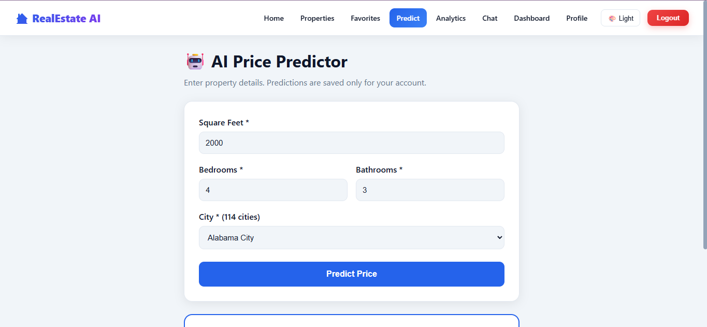
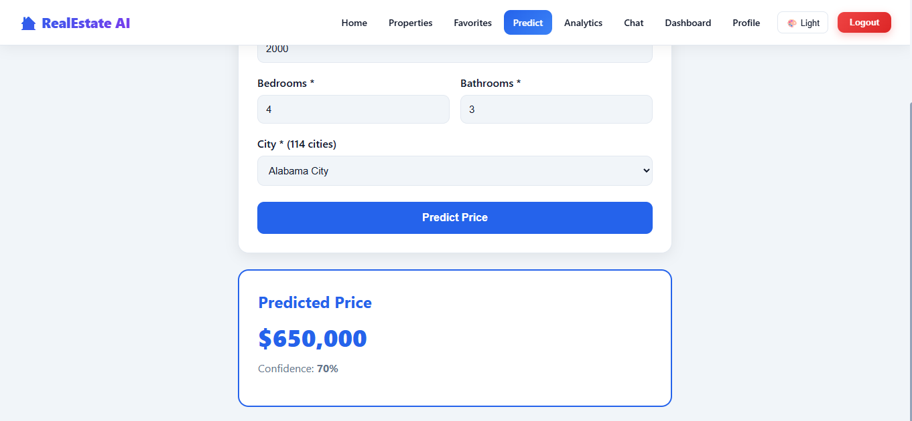
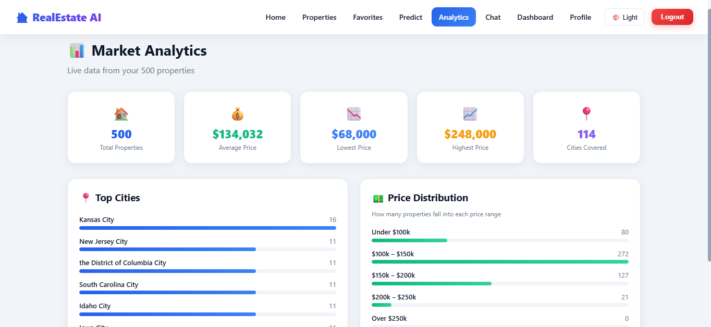
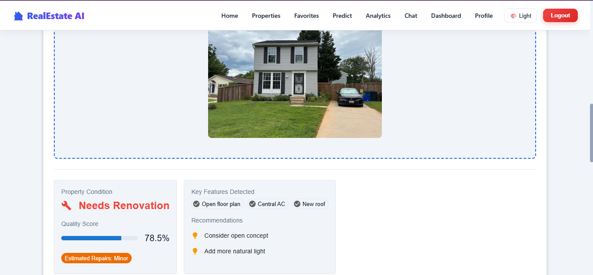
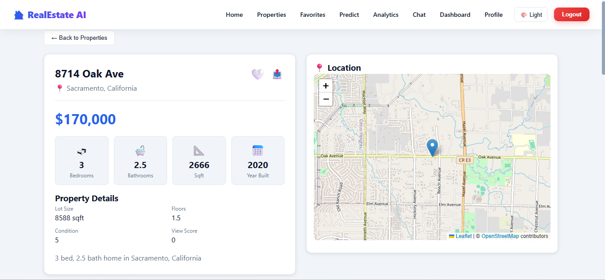
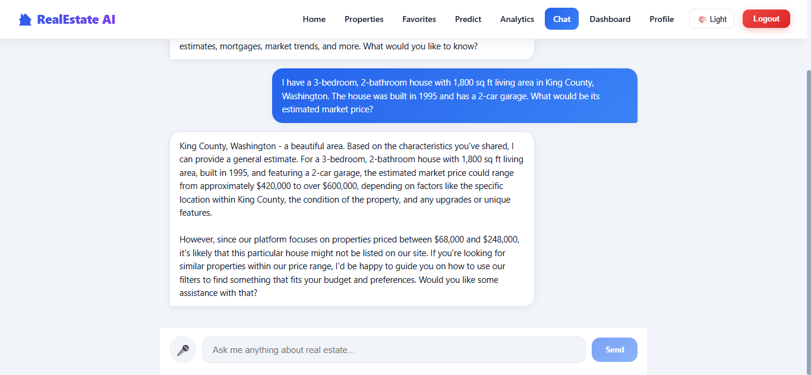

# 🏠 Real Estate AI

An AI-powered real estate intelligence platform that combines machine learning, property analytics, computer vision, interactive maps, and financial tools to help users analyze and estimate residential property values.

## 🌐 Live Demo

**Live Application:**
https://realestate.gayathiriportfolio.xyz

**GitHub Repository:**
https://github.com/Gayathiri2303/Real_Estate_AI

---

## 📌 Project Overview

Real Estate AI is a full-stack web application designed for residential property analysis and price prediction.

The platform allows users to:

* Predict property prices using machine learning
* Explore and analyze properties
* View property details and price history
* Compare properties
* Analyze property locations using interactive maps
* Upload property images for AI-based analysis
* Calculate mortgage payments
* Search properties using voice input
* Manage user accounts and authentication
* View analytics and property insights

---

## ✨ Key Features

### 🏠 Property Price Prediction

Machine learning models are used to estimate property prices based on property characteristics such as:

* Location
* Bedrooms
* Bathrooms
* Living area
* Lot area
* Property condition
* Property grade
* Year built
* Other property attributes

### 🤖 AI / Machine Learning

The project includes trained machine learning models for real estate price prediction.

Models are stored in:

```text
trained_models/

├── best_model.pkl
├── house_price_model.pkl
├── scaler.pkl
└── feature_columns.json
```

## 📸 Application Screenshots

### 🏠 Dashboard



### 🏡 Property Price Prediction



### 💰 Prediction Result



### 📊 Analytics & Charts



### 👁️ AI Image Vision



### 🗺️ Property Map



### 🤖 AI Real Estate Chatbot



---

## 🛠️ Technologies Used

* Python
* Machine Learning
* Scikit-learn
* Pandas
* NumPy
* JavaScript
* HTML
* CSS
* PostgreSQL
* REST API
* Computer Vision
* Interactive Maps

---

## 📂 Project Structure

```text
Real_Estate_AI/
│
├── backend/
│
├── frontend/
│
├── notebooks/
│
├── screenshots/
│   ├── dashboard.png
│   ├── prediction-input.png
│   ├── prediction-result.png
│   ├── analytics-charts.png
│   ├── ai-imagevision.png
│   ├── property-map.png
│   └── ai-chatbot.png
│
├── trained_models/
│   ├── best_model.pkl
│   ├── house_price_model.pkl
│   ├── scaler.pkl
│   └── feature_columns.json
│
├── create_db.py
├── test.py
├── test_db.py
├── test_pg.py
├── package.json
├── package-lock.json
└── README.md
```

---

## 🚀 Deployment

The application is deployed and accessible through the live demo:

**https://realestate.gayathiriportfolio.xyz**

The project is designed for real-world deployment with backend services, machine learning models, database integration, and a web-based frontend.

---

## 🎯 Project Goal

The goal of Real Estate AI is to combine traditional real estate analytics with artificial intelligence to provide users with useful insights for property valuation, comparison, location analysis, and decision-making.

---

## 👩‍💻 Author

**Gayathiri R**

B.Sc. Mathematics | Data Science & Machine Learning Enthusiast

GitHub:
https://github.com/Gayathiri2303

LinkedIn:
https://www.linkedin.com/in/gayathiri23
